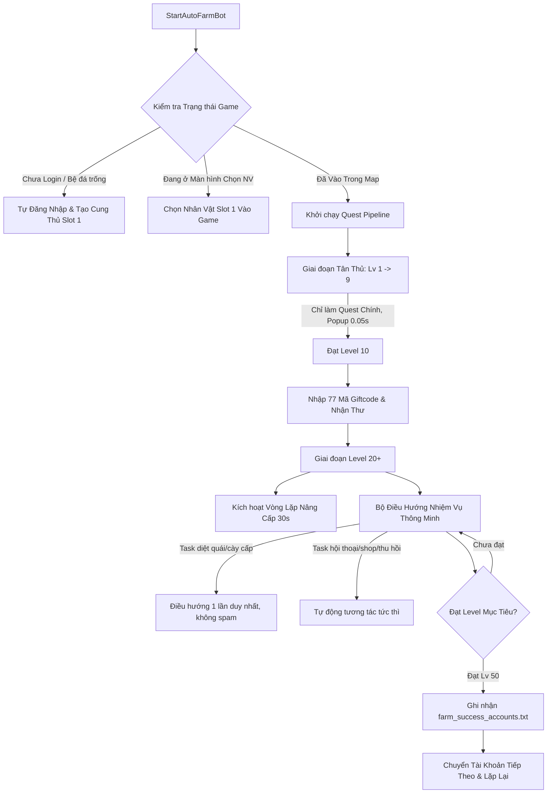

# TÀI LIỆU KIẾN TRÚC & QUY TRÌNH HOẠT ĐỘNG TOÀN DIỆN - FARM BOT (MU VĨNH HẰNG)

> **Môi trường mục tiêu:** `final\modified_lua_dev_farm\EmmyluaDebug.lua`  
> **Cập nhật ngày:** 02/10/2026  
> **Mục đích:** Lưu trữ toàn bộ luồng logic, cấu trúc hàm và cơ chế vận hành của bot để tiếp tục phát triển và bảo trì.

---

## 1. TỔNG QUAN HỆ THỐNG (SYSTEM OVERVIEW)

Hệ thống Farm Bot được thiết kế để tự động hóa 100% vòng đời cày cuốc của nhân vật từ **Level 1** cho đến **Level mục tiêu** (mặc định Level 50 hoặc tùy biến theo `Mod_Farm_TargetLevel`), sau đó tự động ghi nhận và chuyển sang tài khoản tiếp theo trong danh sách `farm_accounts.txt`.

---

## 2. QUY TRÌNH VẬN HÀNH CHI TIẾT THEO TỪNG GIAI ĐOẠN

### Giai đoạn 0: Khởi động, Đăng nhập & Tạo nhân vật tự động
* **Hàm điều phối:** `_G.StartAutoFarmBot()`, `StartFullLoginProcess()`, `CreateRoleAndEnterGame(1)`
* **Logic xử lý bệ đá trống (Tài khoản mới):**
  - Khi tài khoản mới đăng nhập lần đầu, danh sách nhân vật rỗng (`curRoleCount == 0`) hoặc đang hiển thị giao diện `Login_LoginCreateRoleUI`.
  - Bot tự động phát hiện và gọi `CreateRoleAndEnterGame(1)`: chọn hệ phái **Cung Thủ (Archer / Elf)** tại Slot 1, random đặt tên và tiến vào game mà không cần can thiệp thủ công.
* **Cơ chế chống kẹt & mất mạng:**
  - Nếu xuất hiện popup mất kết nối (`Com_DialogUI`), bot tự động bấm nút Thử lại hoặc Thoát đăng nhập lại (`DismissBlockers`).

---

### Giai đoạn 1: Tân thủ Level 1 -> 9 (Chuỗi Main Quest thuần túy)
* **Nguyên tắc "Tĩnh lặng":**
  - Từ Lv 1 đến 9, bot **tuyệt đối KHÔNG** nhập Giftcode, KHÔNG chạy phó bản, KHÔNG nâng cấp đồ làm đầy túi hay ngắt luồng tân thủ.
  - Bot chỉ tập trung bám sát 100% vào chuỗi nhiệm vụ chính (Main Quest).
* **Tối ưu hóa tốc độ nhận thưởng popup:**
  - Hook hàm `_G.Task_TaskInfoUI.StartAutoCurTask`: Rút ngắn thời gian đếm ngược tự động nhận từ **5 giây xuống còn 0.05 giây**.
  - Kiểm tra trạng thái hiển thị chuẩn `taskInfoUI.visible == true` và `UIManager.IsVisible`.
* **Cơ chế kích hoạt nhiệm vụ Level 1:**
  - Tự động kích hoạt luồng tương tác NPC ngay từ Level 1 qua `TaskManager.TaskGo(taskId)`, `AutoTaskManage.SetAutoTask(true)` và `Task_TaskUI:TaskItemClick(taskId)` (tương đương chạm vào tracker nhiệm vụ trên màn hình).

---

### Giai đoạn 2: Đạt Level 10+ (Khai mở Giftcode & Hòm thư)
* **Hàm điều phối:** `RunAutoGiftcode()`
* **Logic thực hiện:**
  - Khi biến `lvl >= 10` và chưa từng nhập (`not _G.Bot_HasEnteredGiftcodes`):
  - Kích hoạt tuần tự danh sách **77 mã Giftcode**.
  - Nhập xong tự động mở hòm thư nhận toàn bộ quà tặng, ngọc, kim cương và nguyên liệu.

---

### Giai đoạn 3: Đạt Level 20+ (Vòng lặp Cường hóa & Nâng cấp 30s)
* **Hàm điều phối:** `StartGlobal30sUpgradePipeline()`, `RunPeriodicUpgradeCycle()`
* **Chu kỳ quét:** Chạy ngầm độc lập mỗi **30 giây/lần** với 8 tác vụ tự động:
  1. **Mua Máu & Mana:** Kiểm tra túi đồ nếu HP/MP < 100 bình thì tự động mua bù lên 500 bình (`AutoBuyPotionsIfLow(100, 500)`).
  2. **Nhận thưởng SV mới & Phúc lợi ngày:** Tự động claim quà tân thủ, quà điểm danh ngày.
  3. **Phân bổ điểm tiềm năng:** Tự cộng điểm theo thuộc tính tối ưu của phái Cung Thủ (`AutoAddAttributePoints`).
  4. **Tự động mặc đồ xịn:** So sánh lực chiến trang bị trong túi, mặc đồ cao cấp hơn và tự động bấm **Kế Thừa Cường Hóa Nhanh** (`Equip_ZhuanyiFastUI`).
  5. **Thu hồi trang bị rác:** Tự động bán đồ trắng/lam/tím không dùng vào lò rèn BlackSmith (không cần tốn đặc quyền VIP).
  6. **Cường hóa toàn thân:** Tự động đập đều tất cả các món đồ trên người lên mốc **+15** (`AutoEvenEnhanceEquipments(15)`).
  7. **Huỳnh Thạch (Lv > 60):** Tự động khảm và nâng cấp ngọc Huỳnh Thạch lên mốc +15.
  8. **Dọn dẹp màn hình:** Đóng các bảng túi đồ, bảng thông báo che khuất tầm nhìn.

---

### Giai đoạn 4: Bộ điều phối nhiệm vụ thông minh (`TASK_BEHAVIOR`)
* **Hàm điều phối:** `StartNewbieQuestPipeline()` (quét 0.3s/lần)
* **Cơ chế chống spam tìm đường (Khắc phục lỗi giật nhân vật khi đánh quái x/y):**
  - Sử dụng biến nhận diện nhiệm vụ mới `isNewTask = (_G.Bot_CurrentTaskId ~= taskId)`.
  - **Chỉ kích hoạt `TaskGo` và `StartCurAutoTask` ĐÚNG 1 LẦN DUY NHẤT** khi vừa nhận nhiệm vụ.
  - Trong suốt quá trình đang đánh quái `x/y` hoặc cày cấp: Bot giữ nguyên vị trí, bật `AutoFight`, **tuyệt đối không gửi lại lệnh tìm đường**.
  - Tích hợp **Watchdog chống kẹt**: Nếu quá 60s (với đánh quái) hoặc 20s (với đối thoại) mà nhân vật đứng yên không di chuyển, bot mới kích hoạt lại tìm đường để giải kẹt.
* **Bảng phân loại hành vi nhiệm vụ:**

| Loại hành vi (`TASK_BEHAVIOR`) | Tiêu chí nhận diện | Hành động của Bot |
| :--- | :--- | :--- |
| **`LEVEL_UP` (Cày cấp)** | Nhiệm vụ yêu cầu đạt cấp độ, chuyển chức, sách đế vương | Truyền tống tới bãi quái tối ưu nhất của Map hiện tại **1 lần duy nhất**, bật AutoFight |
| **`MONSTER_KILL` (Diệt quái x/y)** | Nhiệm vụ tiêu diệt số lượng quái cụ thể | Tìm đường tới bãi quái 1 lần, bật đánh tự động, chờ hoàn thành |
| **`DIALOGUE` (Đối thoại NPC)** | Nói chuyện, trả lời NPC | Tìm đường tới NPC, tự động mở thoại và bấm submit sau 0.05s |
| **`MAP_TRAVEL` (Chuyển Map)** | Đến Devias, Dungeon, Lost Tower, Atlantis... | Tự động gọi truyền tống tọa độ chính xác của map đích |
| **`SKILL_SHOP` (Mua kỹ năng)** | Nhiệm vụ mua & học kỹ năng tân thủ | Tự mở Shop, tìm đúng sách kỹ năng (Đá Tên Đa Trùng 20409...), mua và cắn sách trong túi để học |
| **`RECYCLE` (Thu hồi đồ)** | Nhiệm vụ thu hồi đồ rác | Tự lọc 1 trang bị rác/bình máu trong túi gửi gói thu hồi hoàn thành quest |
| **`CLAIM TỨC THÌ`** | Bất kỳ quest Chính / Nhánh / Thưởng nào đạt trạng thái Hoàn thành | Gửi gói tin mạng `ReqCompleteTask` & `ReqSubmitTask` trả thưởng tức thì không cần đợi |

---

### Giai đoạn 5: Phó bản Huyết Lâu (BC) & Quảng Trường Quỷ (DS)
* **Điều kiện kích hoạt:** Level nhân vật `>= 100`.
* **Hàm điều phối:** `CheckAndRunBloodCastleOrDemonPlaza()`
* **Cơ chế tối ưu:**
  - Tự động vào phó bản khi đủ vé và lượt.
  - Ngay khi vào phó bản: Tự động gửi gói `ReqSkipWait` / bấm nút **[Mở Ngay]** để bỏ qua 30s đếm ngược chờ đợi.
  - Di chuyển vào trung tâm phó bản, kích hoạt Auto Fight gom quái.
  - Khi hoàn thành phó bản: Tự động thoát ra và tiếp tục luồng nhiệm vụ chính.

---

### Giai đoạn 6: Đạt Level Mục tiêu & Hoán đổi tài khoản tự động
* **Hàm điều phối:** `OnAccountReachLevelGoal(lvl, targetLvl)`
* **Quy trình hoán đổi:**
  1. Dừng toàn bộ các timer theo dõi (`BotQuestMonitorTimer`, `Global30sUpgradeTimer`).
  2. Ghi nhận nhật ký thành công vào file:  
     `persistentDataPath/farm_success_accounts.txt`  
     *Định dạng:* `Thời gian | STT: 0001 | Email: abc@gmail.com | Server: S1 | Level: 50`
  3. Tăng chỉ số tài khoản: `CurrentAccountIndex = CurrentAccountIndex + 1`.
  4. Lưu vị trí vào `PlayerPrefs` để nếu game có văng/khởi động lại vẫn nhớ đúng tài khoản đang chạy.
  5. Gọi `ForceLogoutToLogin()` để thoát ra màn hình đăng nhập.
  6. Sau 3 giây, tự động nạp tài khoản tiếp theo và chạy lại toàn bộ quy trình từ Giai đoạn 0.

---

## 3. DANH MỤC BIẾN & CỜ ĐIỀU KHIỂN TRỌNG TÂM

* `_G.Bot_Running`: Cờ trạng thái tổng thể của Bot (bật/tắt).
* `_G.Bot_CurrentTaskId`: ID nhiệm vụ chính hiện tại đang thực hiện (dùng để chặn spam điều hướng).
* `_G.Bot_LastTaskNavTime`: Timestamp lần cuối kích hoạt điều hướng (phục vụ watchdog chống kẹt).
* `_G.Bot_HasEnteredGiftcodes`: Cờ đánh dấu đã nhập xong 77 mã Giftcode (chỉ chạy 1 lần lúc Lv 10).
* `_G.Global30sUpgradeTimer`: Timer chu kỳ nâng cấp và cường hóa 30s.
* `_G.IsSwitchingAccount`: Cờ bảo vệ chống kích hoạt trùng lặp luồng chuyển đổi tài khoản.
* `_G.CurrentAccountIndex`: Thứ tự tài khoản hiện tại trong danh sách nạp bot.

---

## 4. QUY TẮC PHÁT TRIỂN & DEPLOYMENT CẦN NHỚ (CHECKLIST CHO NGÀY MAI)

1. **Môi trường làm việc:** Chỉ code trực tiếp trên thư mục `final\modified_lua_dev_farm\EmmyluaDebug.lua`.
2. **Master Executor Rule:**
   - Mọi lệnh Git, PowerShell, kiểm tra cú pháp Lua PHẢI ghi nội dung vào file:  
     `final\excute_test\exec_cmd.ps1`
   - Thực thi DUY NHẤT qua lệnh cố định:  
     `powershell -ExecutionPolicy Bypass -File "final\excute_test\executor.ps1"`
3. **Kiểm tra cú pháp trước khi bàn giao:**  
   Luôn chạy `& "lua53\luac53.exe" -p final\modified_lua_dev_farm\EmmyluaDebug.lua` để đảm bảo 0 lỗi syntax.
4. **Không tự ý build APK:** Chỉ build APK khi USER có yêu cầu rõ ràng.
